# Cortex-Net: Privacy-Preserving Federated Learning for Brain Tumor Detection

Cortex-Net is a simulated, end-to-end **Federated Learning (FL)** platform equipped with **Local Differential Privacy (LDP)** designed for collaborative brain tumor classification from MRI slices. 

This platform allows separate, non-cooperating medical institutions (Hospital A, B, and C) to collaboratively train a global **Convolutional Neural Network (CNN)** on their respective MRI slices without centralizing or sharing raw patient data.

---

## 🚀 Key Features

* **Federated Learning (FedAvg)**: Collaborative decentralized training. Parameters are trained locally on client silos and aggregated at the server using the Federated Averaging algorithm.
* **Local Differential Privacy (LDP)**: Protects client models against membership inference and reconstruction attacks. Implements local gradient update clipping ($L_2$ norm) and Gaussian noise addition before weight transmission.
* **Synthetic MRI Engine**: A built-in procedural image generator that synthesizes realistic $128 \times 128$ grayscale 2D brain MRI slices (Normal vs. Tumor) with ventricles, gyri texture, tumors, surrounding edema swelling, and scanner noise.
* **Glassmorphic Web Dashboard**: A premium, real-time UI showing:
  - Slide configurations for rounds, epochs, learning rate, and DP settings.
  - Interactive network topology animations showing parameter uploads and downloads.
  - Telemetry charts plotting Global Test Accuracy and Training Loss.
  - Diagnostic Sandbox: Upload custom MRI files or generate random slices on-the-fly to test model predictions with confidence dials and scan-beam effects.
* **Automated Unit Testing**: Includes unit tests verifying the model outputs, image generator parameters, and DP clipping algorithms.

---

## 🛠️ Technology Stack

* **Deep Learning**: PyTorch (`torch`, `torchvision`)
* **Backend Server**: FastAPI (Python), Uvicorn, WebSockets
* **Data Processing**: NumPy, Pillow, Scikit-Learn
* **Frontend UI**: Vanilla HTML5, CSS3 (Glassmorphism theme), JavaScript
* **Telemetry Visualizations**: Chart.js

---

## 📂 Project Structure

```text
federated_brain_tumor_detection/
├── static/
│   ├── index.html       # Web dashboard layout
│   ├── style.css        # Premium glassmorphic dark-mode CSS
│   └── app.js           # Websocket receiver, topology animator, & Chart.js plots
├── synthetic_data.py    # Procedural MRI generation & IID/Non-IID partitioning
├── model.py             # CNN model & Local Differential Privacy clipping
├── federated.py         # Federated Coordinator (FedAvg orchestrator)
├── server.py            # FastAPI REST & Websocket server routes
├── main.py              # Application entry point (runs uvicorn & starts browser)
├── test_fl.py           # Verification unit tests
├── requirements.txt     # Python package requirements
└── .gitignore           # Ignores local dataset folders and caches
```

---

## ⚙️ Setup and Running Instructions

### 1. Clone the Repository & Install Dependencies
First, clone the repository to your local machine and install the required libraries:
```bash
pip install -r requirements.txt
```

### 2. Run Unit Tests
Confirm everything is set up correctly by executing the verification test suite:
```bash
python test_fl.py
```

### 3. Start the Platform
Launch the coordinator server and the web dashboard by running `main.py`:
```bash
python main.py
```
This starts the FastAPI server on `http://127.0.0.1:8000` and automatically opens a new tab in your web browser.

---

## 📊 System Architecture & End-to-End Workflow

Below is the complete sequence of operations showing how parameters and data flow from initialization to diagnostic prediction:

```mermaid
sequenceDiagram
    autonumber
    actor User as User (Web Dashboard)
    participant UI as Browser UI (app.js)
    participant WS as WebSocket Connection
    participant Server as FastAPI Server (server.py)
    participant FL as FL Coordinator (federated.py)
    participant DP as Privacy Shield (model.py)
    participant Clients as Hospital Clients (A, B, C)
    
    %% PHASE 1: DATA SETUP
    rect rgb(20, 24, 46)
        Note over User, Clients: Phase 1: Local Dataset Setup
        User->>UI: Click "Generate Dataset"
        UI->>Server: POST /api/generate-data
        Server->>FL: generate_data()
        Note over FL: Generate synthetic 2D MRI slices<br/>(skull, brain lobes, ventricles, noise)<br/>skewed for Non-IID hospitals
        FL->>Server: Complete
        Server-->>UI: Response: started
        FL->>WS: Broadcast status: data_generated
        WS-->>UI: Update client cards (dataset sizes)
    end

    %% PHASE 2: FL TRAINING
    rect rgb(30, 34, 56)
        Note over User, Clients: Phase 2: Federated Training Rounds Loop
        User->>UI: Adjust Hyperparameters & Click "Start Training"
        UI->>Server: POST /api/start-training
        Server->>FL: start_training() in background thread
        FL->>WS: Broadcast: init (Round 0 baseline test accuracy)
        
        loop For Round 1 to N
            FL->>WS: Broadcast: round_start
            UI->>UI: Animate weights download Server -> Clients
            
            loop For Each Hospital Client (A, B, C)
                FL->>Clients: Download global weights (W_global)
                FL->>WS: Broadcast: client_start (Hospital training...)
                UI->>UI: Set client card status to "Training..."
                
                Note over Clients: Train model locally for E epochs<br/>using local MRI slices
                Clients->>FL: Local trained weights (W_local)
                
                %% Privacy Shield
                FL->>DP: Apply Differential Privacy
                Note over DP: 1. Delta: dW = W_local - W_global<br/>2. L2 Clipping: Clip dW to threshold C<br/>3. Noise: Add Gaussian noise N(0, σ²C²)
                DP-->>FL: return W_protected
                
                FL->>WS: Broadcast: client_complete
                UI->>UI: Animate weights upload Client -> Server
            end
            
            Note over FL: Aggregator Server runs FedAvg:<br/>Weighted average of W_protected weights
            FL->>FL: Update W_global with aggregated weights
            Note over FL: Evaluate W_global on global test set
            FL->>WS: Broadcast: round_complete (Accuracy, Loss)
            UI->>UI: Plot new points on Chart.js graphs
        end
        FL->>WS: Broadcast: status: completed
    end

    %% PHASE 3: INFERENCE PLAYGROUND
    rect rgb(15, 30, 45)
        Note over User, Clients: Phase 3: Diagnostic Playground (Inference)
        User->>UI: Select sample MRI or generate random slice
        UI->>Server: POST /api/generate-random-mri
        Server-->>UI: Return image URL
        User->>UI: Click "Analyze MRI Slice"
        UI->>UI: Start glowing scanner sweep animation
        UI->>Server: POST /api/predict-image (image_path)
        Server->>FL: run_single_inference()
        Note over FL: Feed image to global CNN model
        FL-->>Server: Return Probability
        Server-->>UI: Diagnosis: Tumor | Probability Score
        UI->>UI: Stop scanner, update outcome card,<br/>and set radial progress bar
    end
```



### Detailed Execution Steps:
1. **Decentralized Data Generation**: MRI scans are procedurally generated and stored in isolated client folders (`data/hospital_a/`, etc.). No client has access to another hospital's local directory.
2. **Global Model Dispatch**: In each federated round, the server serializes the global model weights ($W_{\text{global}}$) and broadcasts them to all clients.
3. **Local Training**: Clients download the weights, initialize a local PyTorch training loop on their own MRI scans, and generate updated parameters ($W_{\text{local}}$).
4. **Local Differential Privacy (LDP) Shielding**: The client calculates the parameter update delta, clips its $L_2$ norm to a clipping bound $C$ to restrict outlier influence, adds noise calibrated to the parameter shape and noise multiplier $\sigma$, and returns the private weights to the server.
5. **Federated Averaging (FedAvg)**: The server averages the privacy-protected updates from all clients (weighted by local sample counts) to form the new global model.
6. **Telemetry Streaming**: Real-time evaluation results on a separate test set are piped over WebSockets to update the dashboard charts and topology canvas.
7. **Sandbox Inference Playground**: Users select or upload an MRI slice, triggering the scanner sweep animation. The global model outputs the tumor probability score and updates the UI gauge and diagnosis card.

---

## 🧠 Core Mathematical Concepts

### Federated Averaging (FedAvg)
Rather than centralizing patient datasets $D_1, D_2, \dots, D_K$ on a single server, each client trains a local copy of the model weights $W$ on its own data for $E$ epochs. At the end of each round, the central coordinator aggregates the weights:
$$W_{\text{global}}^{t+1} = \sum_{k=1}^K \frac{n_k}{N} W_k^{t+1}$$
Where $n_k$ is the local sample size of client $k$, and $N$ is the total samples across all active clients.

### Local Differential Privacy (LDP)
To ensure that the uploaded parameters $W_k$ do not leak patient MRI features, each hospital clips and noises their weight updates ($\Delta W = W_{\text{local}} - W_{\text{global}}$):
1. **Clipping**: Bounds parameter update sensitivity to a threshold $C$:
   $$\Delta W_{\text{clipped}} = \Delta W \cdot \min\left(1, \frac{C}{\|\Delta W\|_2}\right)$$
2. **Noising**: Adds calibrated Gaussian noise scaled by the clip bound and noise multiplier $\sigma$:
   $$\Delta W_{\text{noised}} = \Delta W_{\text{clipped}} + \mathcal{N}(0, \sigma^2 C^2)$$
3. **Reassembly**: Sends $W_{\text{global}} + \Delta W_{\text{noised}}$ to the coordinator.
